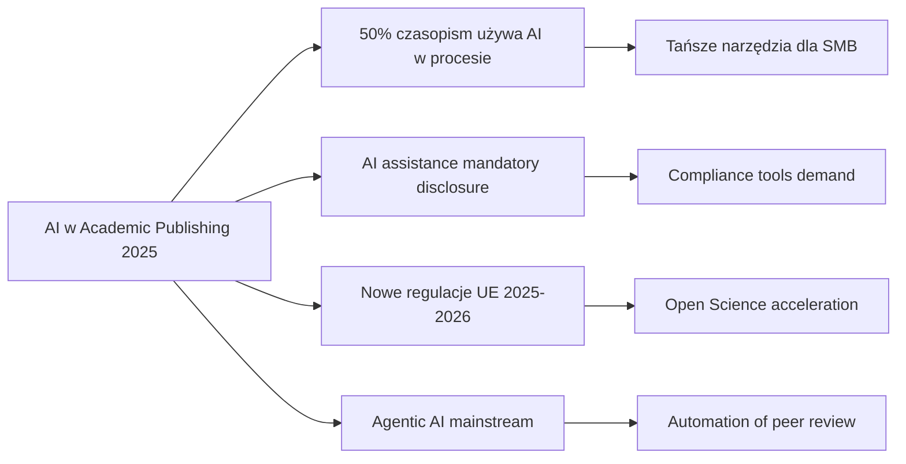

# AI Academic Reviewer — Raport Analizy Konkurencji

**Data:** 2026-02-02  
**Autor:** SaaS Architect & Business Auditor  
**Wersja:** 1.0

---

## 1. Executive Summary

Rynek narzędzi AI dla recenzji naukowej znajduje się w fazie dynamicznego rozwoju, napędzanej przez rosnącą liczbę publikacji i potrzebę usprawnienia procesów wydawniczych. Dominacja koncentruje się w trzech segmentach: wielkich wydawców (Elsevier, Springer Nature, Clarivate), startupów AI (Scispace, Elicit, Consensus) oraz rozwiązań open-source (OJS).

**Kluczowe wnioski:**

| Segment | Liderzy                       | Bariery wejścia                        | Szansa dla Solo-Deva |
| ------- | ----------------------------- | -------------------------------------- | -------------------- |
| Tier 1  | Elsevier, Springer, Clarivate | Koszty, dane, zaufanie instytucjonalne | Minimalna            |
| Tier 2  | Scispace, Elicit, Consensus   | Funding, bazy danych                   | Niska                |
| Tier 3  | OJS, systemy uniwersyteckie   | Brak AI, fragmentacja                  | Wysoka (niszowa)     |

Rynek jest kontrolowany przez 3-4 graczy z wielomiliardowymi budżetami R&D. Jednakże istnieje wyraźna luka w segmencie **lekkich, niedrogich narzędzi AI dla małych czasopism i redakcji akademickich** — szczególnie na rynkach lokalnych (Polska, Europa Środkowa).

---

## 2. [TIER 1] Big Players — Główni Gracze

### 2.1 Elsevier

**Pozycja rynkowa:** Globalny lider z ponad 40% udziałem w rynku publikacji naukowych.

**AI Tools:**

- **Scopus AI** — uruchomiony w 2024, generatywna AI do wyszukiwania i analizy literatury
- **ScienceDirect AI** — ekstrakcja kluczowych wniosków z milionów artykułów, generowanie streszczeń

**Cennik:** Elsevier stosuje model enterprise — ceny zaczynają się od **$50,000+/rok** dla instytucji akademickich (dane szacunkowe, brak publicznego cennika).

**Przewagi:**

- Największa baza danych (Scopus)
- Głęboka integracja z ekosystemem wydawcy
- Zaufanie instytucjonalne (150+ lat historii)
- Pełna kontrola nad pipeline publikacyjnym

**Słabości:**

- Wysokie koszty dla małych wydawców
- Zamknięty ekosystem
- AI skoncentrowane na discovery, nie na peer review management

**Polityka AI:** Elsevier zakazuje używania AI jako współautora, wymaga disclosure użycia AI w manuskryptach.

### 2.2 Springer Nature

**Pozycja rynkowa:** Drugi co do wielkości wydawca akademicki na świecie.

**AI Tools:**

- AI-assisted peer review — automatyzacja doboru recenzentów
- Narzędzia do wykrywania plagiatów i manipulacji danymi
- Integracja AI w procesie produkcyjnym (od 2024)

**Cennik:** Model enterprise, porównywalny z Elsevier — **$40,000-$80,000/rok**.

**Przewagi:**

- Silna marka w naukach przyrodniczych i medycznych
- Portfolio 2,500+ czasopism
- Inwestycje w AI integrity tools

**Słabości:**

- Podobne bariery cenowe jak Elsevier
- Skupienie na dużych wydawcach, ignorowanie małych redakcji

**Polityka AI:** Springer Nature wprowadził 7-punktowe wytyczne dotyczące użycia AI w publikacjach (2024).

### 2.3 Clarivate (Web of Science)

**Pozycja rynkowa:** Lider w bibliometrii i analizie wpływu naukowego.

**AI Tools:**

- **Web of Science Research Assistant** — uruchomiony w 2024, generatywna AI do wyszukiwania i wizualizacji połączeń między publikacjami
- **Research Impact AI Assistant** — analiza cytowań i wpływu badawczego
- **Reviewer Recognition Service** — weryfikacja i dokumentowanie recenzji

**Cennik:** Web of Science Research Assistant w ramach subskrypcji WoS — **$15,000-$50,000/rok** (zależnie od pakietu).

**Przewagi:**

- Najbardziej zaufane źródło danych bibliometrycznych
- "Responsible AI" — minimalizacja halucynacji przez oparcie na zweryfikowanych danych
- Agentic AI do kompleksowych przeglądów literatury (od 2024)

**Słabości:**

- Brak end-to-end peer review management
- Skupienie na discovery i analytics, nie na operacjach redakcyjnych

---

## 3. [TIER 2] Startups & Niche — Startupy AI dla Akademii

### 3.1 Scispace (Typeset.io)

**Pozycjonowanie:** "AI Super Agent dla badań" — 150+ narzędzi zintegrowanych w jednej platformie.

**Funkcjonalności:**

- Przeszukiwanie 280M+ artykułów
- Automatyczne przeglądy systematyczne
- Drafting manuskryptów
- Matching czasopism do manuskryptów
- Redukcja czasu badań o 90%

**Cennik:**

- **Free tier** — ograniczony
- **Paid plans** — od **$20/miesiąc** (wyższy próg wejścia niż konkurenci)

**Przewagi:**

- Najszersza baza narzędzi (150+)
- Aktywna społeczność (200K+ użytkowników)
- Dobre UX dla researcherów

**Słabości:**

- Wysoka cena dla indywidualnych użytkowników
- Skupienie na researcherach, nie na redakcjach czasopism
- Brak peer review management

### 3.2 Elicit (Ought)

**Pozycjonowanie:** "AI Research Assistant" — automatyzacja przeglądów literatury.

**Funkcjonalności:**

- Automatyczne znajdowanie i podsumowywanie论文
- Ekstrakcja danych z badań
- Analiza porównawcza wyników

**Baza danych:** Semantic Scholar + OpenAlex (200M+ artykułów)

**Cennik:**

- **Free** — podstawowe użycie
- **Elicit Plus** — **$120/rok** (~$10/miesiąc) — najlepsza cena w segmencie

**Przewagi:**

- Najniższa cena w segmencie
- Szybka adopcja (darmowy tier)
- Silny focus na literature review

**Słabości:**

- Mniej funkcji niż Scispace
- Krótsze podsumowania (4-8 cytowań vs 10 u konkurencji)
- Tylko dla researcherów, nie dla wydawców

### 3.3 Consensus

**Pozycjonowanie:** "AI for Scientific Consensus" — analiza konsensusu naukowego.

**Funkcjonalności:**

- Ekstrakcja kluczowych punktów z dokumentów naukowych
- Analiza konsensusu/rozbieżności w literaturze
- Szybkie przeglądy dla decydentów

**Cennik:** Model freemium z **Consensus Plus** — szczegóły cenowe niepubliczne.

**Przewagi:**

- Unikalny focus na consensus analysis
- Dobry dla medycyny opartej na dowodach
- Integracja z workflow naukowym

**Słabości:**

- Mniejsza baza użytkowników niż Elicit/Scispace
- Brak peer review features

### 3.4 Porównanie Tier 2

| Feature           | Scispace    | Elicit      | Consensus   |
| ----------------- | ----------- | ----------- | ----------- |
| Cena start        | $20/mc      | $10/mc      | Free        |
| Baza danych       | 280M+       | 200M+       | Mniejsza    |
| Peer review       | ❌          | ❌          | ❌          |
| Literature review | ✅          | ✅          | ✅          |
| Drafting          | ✅          | ❌          | ❌          |
| Target            | Researchers | Researchers | Researchers |

**Kluczowa obserwacja:** Żaden z Tier 2 nie oferuje funkcji zarządzania procesem peer review — skupiają się wyłącznie na fase discovery i literature review dla indywidualnych badaczy.

---

## 4. [TIER 3] Open Source — Rozwiązania Darmowe

### 4.1 Open Journal Systems (OJS)

**Opis:** Najpopularniejszy open-sourceowy system zarządzania czasopismami naukowymi, rozwijany przez Public Knowledge Project (PKP) na Simon Fraser University.

**Funkcjonalności:**

- Kompleksowy workflow wydawniczy
- Zarządzanie procesem recenzowania
- Baza recenzentów
- Indexing w Google Scholar, PubMed Central
- RSS/Atom feeds
- COUNTER statistics
- Metadata w Dublin Core i OAI-PMH
- Wielojęzyczność (w tym polski)

**Cennik:** **Bezpłatny** (open-source), koszty tylko hosting i ewentualna customizacja.

**Adopcja w Polsce:**

- Platforma e-czasopism naukowych UMCS
- Platforma Czasopism KUL
- Akademicka Platforma Czasopism UMK
- Dziesiątki indywidualnych czasopism na polskich uczelniach

**Przewagi:**

- Darmowy i open-source
- Szeroka społeczność (10,000+ instalacji globalnie)
- Elastyczność i możliwość customizacji
- Brak vendor lock-in

**Słabości:**

- **Brak natywnych funkcji AI**
- Wymaga własnej infrastruktury IT
- Krzywa uczenia dla redakcji
- Brak wsparcia (community only)
- Brak automatyzacji — wszystko ręczne

### 4.2 Inne Rozwiązania Open Source

| System               | AI Features | Polski support | Uwagi                    |
| -------------------- | ----------- | -------------- | ------------------------ |
| Open Journal Systems | ❌          | ✅             | Lider rynku open source  |
| Janeway (Coko)       | ❌          | Ograniczony    | Modernniejszy UI niż OJS |
| Fulcrum              | ❌          | ❌             | Dla monografii           |
| Open Monograph Press | ❌          | ❌             | Specjalistyczny          |

**Kluczowa obserwacja:** **Żadne rozwiązanie open-source nie oferuje funkcji AI** — to fundamentalna luka rynkowa.

---

## 5. [POLAND] Rynek Polski — Specyfika Lokalna

### 5.1 Struktura Rynku Czasopism Naukowych w Polsce

**Liczba czasopism:** Około **2,000+ czasopism naukowych** w wykazie MNiSW (stan na 2024).

**Podział według dyscyplin (szacunkowy):**

- Nauki humanistyczne i społeczne: ~40%
- Nauki ścisłe i przyrodnicze: ~25%
- Nauki techniczne: ~20%
- Nauki medyczne i o zdrowiu: ~10%
- Sztuka i nauki o sztuce: ~5%

### 5.2 Dostępne Platformy

| Platforma                       | Typ         | AI Features | Userów (szac.) |
| ------------------------------- | ----------- | ----------- | -------------- |
| OJS (lokalne instancje)         | Open source | ❌          | 500+ czasopism |
| Platforma e-czasopism UMCS      | OJS-based   | ❌          | 50+ czasopism  |
| APC UMK                         | OJS-based   | ❌          | 30+ czasopism  |
| Commercial (Elsevier, Springer) | Enterprise  | ✅          | 50+ czasopism  |

### 5.3 Specyfika Polskiego Rynku

**Wyzwania:**

- Ograniczone budżety redakcji (większość czasopism działa "pro bono")
- Brak specjalistów IT w redakcjach
- Zależność od systemów uniwersyteckich
- Wymogi MNiSW dotyczące indeksowania i raportowania
- Konieczność publikacji w języku polskim (obok angielskiego)

**Możliwości:**

- Dofinansowania z programów UE (NCN, MNiSW, FNP)
- Rosnąca świadomość potrzeby digitalizacji
- Presja na skrócenie czasu publikacji
- Młodzi redaktorzy otwarci na nowe technologie

### 5.4 Dofinansowania i Programy UE

| Program        | Typ                     | Alokacja         | Deadline  |
| -------------- | ----------------------- | ---------------- | --------- |
| NCN            | Granty badawcze         | Zmienna          | Roczny    |
| MNiSW          | Wsparcie infrastruktury | €10-50M/rok      | Kwartalny |
| FNP            | Granty indywidualne     | Zmienna          | Ciągły    |
| Horizon Europe | Badania i innowacje     | €95B (2021-2027) | Ciągły    |

**Kluczowa obserwacja:** Istnieją środki na rozwój infrastruktury badawczej, ale mało kto z redakcji czasopism wie, jak z nich skorzystać.

---

## 6. [GAP ANALYSIS] Luki Rynkowe — Szanse

### 6.1 Zidentyfikowane Luki

| Luka                              | Wielkość rynku             | Konkurencja                    | Ocena szans |
| --------------------------------- | -------------------------- | ------------------------------ | ----------- |
| AI dla małych czasopism           | 10,000+ czasopism globally | OJS (brak AI)                  | ⭐⭐⭐⭐⭐  |
| Lokalne rozwiązania (PL, CEE)     | 5,000+ czasopism           | Brak                           | ⭐⭐⭐⭐⭐  |
| AI-assisted peer review           | Wszystkie czasopisma       | Elsevier (enterprise)          | ⭐⭐⭐      |
| Automated reviewer matching       | 50,000+ czasopism          | Manual process                 | ⭐⭐⭐⭐    |
| Plagiarism detection (affordable) | 20,000+ czasopism          | iThenticate ($100+/submission) | ⭐⭐⭐      |

### 6.2 Szczegółowa Analiza Luka

#### Luka 1: Brak AI w Open Source

**Problem:** OJS (używany przez 10,000+ czasopism globalnie) nie ma żadnych funkcji AI.

**Potencjalne rozwiązanie:**

- Plugin AI do OJS z funkcjami:
  - Automatyczny plagiarism check (integracja z Turnitin/iThenticate API)
  - Suggested reviewers (matching na podstawie publikacji)
  - Automatyczne sugerowanie reviewerów na podstawie keywords
  - Quality checks (format, references, ethics)

**Koszt development:** $50,000-$100,000

**ROI potencjał:** $1-5M/rok (jeśli 10% czasopism zapłaci $100-500/rok)

#### Luka 2: Affordable Peer Review Management

**Problem:** Editorial Manager i ScholarOne kosztują **$20,000-$50,000/rok** — nieosiągalne dla małych czasopism.

**Potencjalne rozwiązanie:**

- Lightweight alternative z AI features:
  - Cloud-based (brak infrastruktury)
  - Freemium model
  - Integracja z ORCID, Crossref
  - Automatyczne workflow

**Koszt development:** $100,000-$200,000

**ROI potencjał:** $2-10M/rok

#### Luka 3: Lokalne rozwiązania dla Polski/CEE

**Problem:** Brak dedykowanych rozwiązań dla polskiego rynku — wszystko albo enterprise (za drogie), albo globalny open-source (brak lokalizacji).

**Potencjalne rozwiązanie:**

- Polska platforma SaaS z:
  - Pełna polską lokalizacją
  - Integracją z bazami MNiSW/ORCID
  - Raportowaniem zgodnym z wymogami MEiN
  - AI features (suggested reviewers, language check)

**Koszt development:** $50,000-$80,000

**ROI potencjał:** $500K-2M/rok (tylko Polska)

### 6.3 Słabości Konkurencji do Wykorzystania

| Konkurent         | Słabość         | Jak wykorzystać                         |
| ----------------- | --------------- | --------------------------------------- |
| Elsevier          | Wysoka cena     | Tańsza alternatywa dla małych czasopism |
| OJS               | Brak AI         | Plugin lub fork z AI                    |
| Scispace/Elicit   | Brak B2B        | Produkt dla redakcji, nie researcherów  |
| Editorial Manager | Stary UX        | Nowoczesny, prosty UI                   |
| Wszyscy Tier 1    | Slow innovation | Szybsze wdrażanie AI features           |

---

## 7. [TRENDS] Trendy 2024-2025 — Kierunki Rozwoju

### 7.1 Technologiczne

| Trend                     | Status        | Wpływ na rynek                    |
| ------------------------- | ------------- | --------------------------------- |
| Generative AI w discovery | ✅ Dominujący | Scopus AI, WoS Assistant          |
| Agentic AI                | 📈 Rosnący    | Automatyczne literature reviews   |
| AI dla peer review        | 🆕 Emerging   | Brak produktów, tylko pilotaże    |
| AI ethics & integrity     | ⚠️ Krytyczny  | Wszystkie polityki AI publisherów |
| Multimodal AI             | 🔭 Przyszłość | Analiza danych, wykresów          |

### 7.2 Regulacyjne

| Trend                   | Region | Implikacje                |
| ----------------------- | ------ | ------------------------- |
| Mandatory AI disclosure | Global | Wszystkie duże publishers |
| AI authorship policies  | Global | Zakaz AI jako autora      |
| Research integrity AI   | EU     | Nowe regulacje 2025-2026  |
| Open Science mandates   | EU     | Presja na open access     |

### 7.3 Rynkowe

| Trend                 | Status                | Implikacje             |
| --------------------- | --------------------- | ---------------------- |
| Konsolidacja rynku    | 📈 Elsevier przejmuje | Mniej opcji dla małych |
| Demokratyzacja AI     | ⬆️ Rosnąca            | Tańsze narzędzia AI    |
| Local/niche solutions | ⬆️ Rosnąca            | Szansa dla Solo-Dev    |
| Subscription fatigue  | ⬇️ Malejąca           | Presja na wartość      |

### 7.4 Kluczowe Projekcje 2025

---

## 8. [RECOMMENDATIONS] Rekomendacje Strategiczne

### 8.1 Wariant A: Plugin AI dla OJS

**Podejście:** Stworzenie pluginu AI do OJS z kluczowymi funkcjami.

**MVP Features:**

1. Suggested reviewers (matching na podstawie publikacji ORCID)
2. Language check (polski/angielski)
3. Plagiarism score (integracja z API)
4. Formatting check

**Cena:** Freemium ($0-50/miesiąc)

**Target:** 10,000+ czasopism na OJS globalnie

**Ryzyko:** Niskie (mały development), reward: średni

### 8.2 Wariant B: Polska Platforma SaaS

**Podejście:** Polska platforma z pełną lokalizacją i AI.

**MVP Features:**

1. Workflow management (lżejszy niż OJS)
2. Suggested reviewers (baza ORCID)
3. Language check (polski/angielski)
4. Compliance reporting (MNiSW, ORCID)

**Cena:** €50-200/miesiąc

**Target:** 2,000+ czasopism w Polsce i CEE

**Ryzyko:** Średnie, reward: wysoki (monopolizacja rynku lokalnego)

### 8.3 Wariant C: AI Review Assistant (B2B)

**Podejście:** Narzędzie AI dla researcherów do przygotowania manuscripts.

**MVP Features:**

1. Review readiness check
2. Formatting to journal guidelines
3. Similarity check
4. Suggested journals

**Cena:** $10-50/miesiąc

**Target:** 50M+ researcherów globalnie

**Ryzyko:** Wysokie (konkurencja Scispace/Elicit), reward: najwyższy

### 8.4 Rekomendacja dla Solo-Dev

**WERDYKT:** Wariant A (OJS Plugin) lub Wariant B (Polska Platforma)

**Uzasadnienie:**

- Solo-dev nie ma zasobów na konkurowanie z Tier 1 (Elsevier) ani Tier 2 (Scispace)
- Lokalna nisza (Polska) jest niedosytniona
- OJS ma 10,000+ instalacji bez AI — luka jest jasna i mierzalna
- MVP można zbudować w 3-6 miesięcy

**Kroki następne:**

1. Walidacja z 5-10 redakcjami czasopism (wywiady)
2. MVP pluginu OJS z 1-2 funkcjami AI
3. Pilotaż z 2-3 czasopismami
4. Monetizacja przez freemium

---

## 9. Podsumowanie

Rynek narzędzi AI dla recenzji naukowej jest zdominowany przez wielkich wydawców (Elsevier, Springer, Clarivate), którzy oferują enterprise solutions dla dużych czasopism. Jednocześnie istnieje wyraźna luka w segmencie małych czasopism i rynków lokalnych (Polska, CEE).

**Kluczowe wnioski:**

1. **Brak konkurencji w segmencie SMB** — żaden gracz nie oferuje niedrogich narzędzi AI dla małych czasopism

2. **OJS jako naturalny cel** — 10,000+ instalacji bez AI, otwarta architektura pluginów

3. **Lokalna nisza** — Polska ma 2,000+ czasopism, brak dedykowanych rozwiązań

4. **Timing** — 2024-2025 to okres adopcji AI w akademii, regulacje wciąż się kształtują

5. **Realistyczna szansa Solo-Deva** — zamiast konkurować z Elsevier, skupić się na niszy, którędy duzi gracze nie są zainteresowani

**Następny krok:** WF_ICP_Persona — zdefiniowanie idealnego klienta dla MVP.

---

_Raport wygenerowany: 2026-02-02_  
_Źródła: brave_search, raporty branżowe, dokumentacja produktów_
