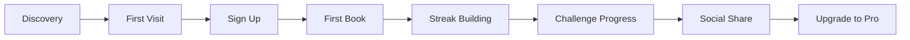

# BookHabitTracker - Plan Implementacji

## 📋 Overview

**One-Liner:** Tracker nawyków czytelniczych z elementami grywalizacji, streaks i wyzwaniami

**Target:** Czytelnicy chcący czytać więcej książek, budować nawyk codziennego czytania

**Model:** Freemium SaaS
- Free: Podstawowe statystyki, 1 aktywne wyzwanie
- Pro ($5/miesiąc): Nieograniczone wyzwania, zaawansowane statystyki, sync
- Lifetime ($39): Early bird

---

## 🎯 MVP Scope (Minimal Viable Product)

### Must-Have Features (v0.1 - 3 tygodnie)

#### 1. Dashboard Główny
```
┌─────────────────────────────────────┐
│  📚 BookHabitTracker               │
├─────────────────────────────────────┤
│  🔥 Streak: 12 dni                 │
│  📖 W tym miesiącu: 3 książki      │
│  🎯 Wyzwanie: 12/24 książki (50%)  │
├─────────────────────────────────────┤
│  [+ Dodaj książkę]                 │
│  [📊 Statystyki]                   │
│  [🏆 Wyzwania]                     │
└─────────────────────────────────────┘
```

#### 2. Dodawanie Książki
- Formularz: Tytuł, Autor, Data ukończenia, Ocena (1-5⭐), Liczba stron
- Walidacja: Wymagane tytuł i data
- localStorage jako backend

#### 3. Lista Książek
- Tabela/karty z przeczytanymi książkami
- Sortowanie: data, ocena, tytuł
- Filtrowanie: rok, miesiąc
- Edycja i usuwanie

#### 4. Streak Counter
- Licznik dni z rzędu z aktywnością czytelniczą
- Logika: Dodanie książki = +1 dzień do streak
- Warning przy zerowaniu (3 dni bez aktywności)
- "Streak freeze" (opcjonalnie w Pro)

#### 5. Podstawowe Statystyki
- Książki w tym miesiącu/tym roku
- Całkowita liczba stron
- Średnia ocena
- Najlepszy miesiąc

#### 6. Roczne Wyzwanie
- Predefiniowane: 12, 24, 52 książki
- Progress bar z procentem ukończenia
- Encouragement messages przy milestone'ach

---

### Nice-to-Have (v0.2 - 4-6 tygodni)

- Export statystyk jako obrazek (do social media)
- Wykresy (Recharts): książki/miesiąc, strony/rok
- Kategorie gatunkowe (fikcja, non-fiction, biznes)
- Notatki do książki (pole tekstowe)

### Pro Features (v1.0 - 2-3 miesiące)

- Firebase Auth + Firestore (sync między urządzeniami)
- Nieograniczone wyzwania niestandardowe
- Szczegółowe analityki (średnia długość książki, tempo czytania)
- Export do CSV/PDF
- Dark mode

---

## 👤 User Journey Map

### Persona: Kasia, 26 lat, pracuje w marketingu
**Cel:** Przeczytać 24 książki w 2024 roku (aktualnie: 3 w Q1 - opóźniona)

### Journey Steps:



#### 1. Discovery (Źródła: Twitter, Reddit r/books, SEO)
- **Trigger:** "Chcę czytać więcej ale nie mam motywacji"
- **Touchpoint:** Post "Jak przeczytałem 52 książki w rok" z linkiem do BookHabitTracker

#### 2. First Visit (Landing Page)
- **Hero:** "Przeczytaj więcej książek w tym roku"
- **Social Proof:** "Dołącz do 1000+ czytelników"
- **CTA:** "Zacznij za darmo"
- **Demo:** Animacja dashboardu

#### 3. Sign Up (Zero-friction)
- **Email + hasło** (lub anonimowe - później rejestracja)
- **Onboarding:** 
  - "Jaki jest Twój cel czytelniczy na ten rok?"
  - Wybór wyzwania: 12/24/52 książki
  - "Dodaj pierwszą książkę którą przeczytałeś w tym roku"

#### 4. First Book (Aha! Moment)
- **Action:** Dodanie pierwszej książki
- **Reward:** "Gratulacje! Twój streak: 1 dzień 🔥"
- **Value:** Natychmiastowa wizualizacja postępów

#### 5. Streak Building (Habit Formation)
- **Mechanika:** Codzienne przypomnienie (opcjonalne)
- **Psychology:** Loss aversion - nie chcesz stracić streak
- **Engagement:** Push notification: "Dodaj dzisiejszą lekturę - 5 dni do nowego rekordu!"

#### 6. Challenge Progress (Motywacja)
- **Milestone 25%:** "Jesteś na dobrej drodze!"
- **Milestone 50%:** "Połowa za Tobą! 🔥"
- **Milestone 75%:** "Ostatnia prosta!"
- **Milestone 100%:** "🎉 Wyzwanie ukończone! Udostępnij sukces"

#### 7. Social Share (Viral Loop)
- **Trigger:** Ukończenie wyzwania / 30 dni streak / roczne podsumowanie
- **Asset:** Wygenerowany obrazek "Mój rok w książkach 2024"
- **Platforms:** Instagram Stories, LinkedIn, Twitter
- **Referral:** "Śledź moje wyzwanie na BookHabitTracker" (link)

#### 8. Upgrade to Pro (Monetyzacja)
- **Trigger:** Chęć dodania więcej niż 1 wyzwania / sync między urządzeniami
- **Pitch:** "Nie trać swoich danych - zsynchronizuj konto"
- **Pricing:** $5/miesiąc lub $39 lifetime

---

## 🛠 Tech Stack

### MVP (v0.1 - localStorage)

| Layer | Technology | Why |
|-------|------------|-----|
| Frontend | React 18 + Vite | Szybki dev server, HMR |
| Styling | Tailwind CSS | Szybkie prototypowanie |
| State | React hooks (useState, useEffect) | Prosto, bez Redux |
| Storage | localStorage | Zero backend, free |
| Charts | Recharts | Proste wykresy |
| Icons | Lucide React | Spójny design |
| Forms | React Hook Form + Zod | Walidacja |

### v1.0 (Firebase)

| Layer | Technology | Why |
|-------|------------|-----|
| Auth | Firebase Auth | Email + Google |
| Database | Firestore | Real-time sync |
| Hosting | Vercel | Darmowy tier, CI/CD |
| Analytics | Firebase Analytics | Podstawowe metryki |

---

## 📁 Project Structure

```
bookhabittracker/
├── src/
│   ├── components/
│   │   ├── Dashboard/
│   │   │   ├── StreakCard.tsx
│   │   │   ├── StatsOverview.tsx
│   │   │   └── ChallengeProgress.tsx
│   │   ├── Books/
│   │   │   ├── BookForm.tsx
│   │   │   ├── BookList.tsx
│   │   │   └── BookCard.tsx
│   │   ├── Challenges/
│   │   │   ├── ChallengeSelector.tsx
│   │   │   └── ChallengeCard.tsx
│   │   └── common/
│   │       ├── Button.tsx
│   │       ├── Input.tsx
│   │       └── Modal.tsx
│   ├── hooks/
│   │   ├── useLocalStorage.ts
│   │   ├── useStreak.ts
│   │   └── useBooks.ts
│   ├── utils/
│   │   ├── dateUtils.ts
│   │   └── statsCalculator.ts
│   ├── types/
│   │   └── index.ts
│   ├── App.tsx
│   └── main.tsx
├── public/
├── package.json
└── tailwind.config.js
```

---

## 🚀 Go-To-Market Strategy

### Faza 1: Pre-launch (2 tygodnie przed)

#### Landing Page
- **Headline:** "Przeczytaj więcej książek w 2024"
- **Subheadline:** "Śledź swoje nawyki, wyzwania i cele czytelnicze"
- **CTA:** "Zapisz się na early access"
- **Email capture:** Waitlist (ConvertKit/Mailchimp)

#### Content Marketing
- Twitter/X thread: "Jak przeczytałem 52 książki w 2023"
- Reddit r/books: "Built a simple book tracker - looking for beta testers"
- LinkedIn: Post o budowaniu nawyków czytelniczych

### Faza 2: Beta Launch (Week 1-2)

#### Target: 50 beta testerów
- Waitlist subscribers
- Friends & family
- Reddit/Twitter community

#### Feedback Collection
- In-app feedback button
- 1-on-1 calls z 5 użytkownikami
- Google Forms survey

### Faza 3: Public Launch (Week 3-4)

#### Product Hunt
- Przygotować:
  - Gallery screenshots
  - Maker comment
  - First comment od znajomego
- Launch o 00:01 PST (najlepszy czas)

#### Social Media Blitz
- Twitter: 3 posty w dniu launch
- LinkedIn: Post o procesie budowania
- Reddit: r/SideProject, r/books, r/webdev

### Faza 4: Growth (Miesiąc 2+)

#### SEO (Long-term)
- Blog posts:
  - "How to read more books"
  - "Best reading challenges 2024"
  - "How to track your reading"
- Programmatic pages: "Reading challenge [year]"

#### Partnerships
- Book bloggers (darmowy Pro za review)
- Bookstagrammers (affiliate 30%)
- Book clubs (group discounts)

#### Viral Loops
- "Share your year in books" (generowany obrazek)
- Referral program (1 miesiąc Pro za zaproszenie)
- Reading challenges (publiczne leaderboardy)

---

## 📅 Roadmap

### Q1 2024 (MVP)
- [ ] Week 1-3: MVP development
- [ ] Week 4: Beta testing (50 users)
- [ ] Week 5: ProductHunt launch
- [ ] Week 6-8: Iteracje na podstawie feedbacku

### Q2 2024 (v1.0)
- [ ] Firebase Auth + Firestore
- [ ] Pro tier ($5/miesiąc)
- [ ] Mobile responsiveness
- [ ] 1000 registered users

### Q3 2024 (Growth)
- [ ] Social sharing features
- [ ] Reading groups
- [ ] Public challenges
- [ ] 5000 registered users
- [ ] $500 MRR

### Q4 2024 (Scale)
- [ ] Mobile app (React Native?)
- [ ] Integrations (Goodreads API)
- [ ] Team/B2B tier
- [ ] 10000 registered users
- [ ] $2000 MRR

---

## 📊 Success Metrics

### MVP Phase (Month 1)
- **Signups:** 200+
- **Active users (weekly):** 50+
- **Books added:** 500+
- **Retention (Day 7):** 30%+

### Growth Phase (Month 3)
- **Registered users:** 1000+
- **Active users (monthly):** 300+
- **Pro conversions:** 5%+
- **MRR:** $100+

### Scale Phase (Month 6)
- **Registered users:** 5000+
- **Active users (monthly):** 1500+
- **Pro conversions:** 8%+
- **MRR:** $500+

---

## ⚠️ Risk Mitigation

### Risk 1: Low Engagement
**Mitigation:** 
- Push notifications (opcjonalne)
- Email reminders
- Gamification (badges, achievements)

### Risk 2: Churn
**Mitigation:**
- Streak mechanics (loss aversion)
- Community features
- Regular new challenges

### Risk 3: Competition (StoryGraph, Goodreads)
**Mitigation:**
- Focus na nawyki, nie na społeczność
- Simpler UI
- Mobile-first

### Risk 4: Technical (localStorage limits)
**Mitigation:**
- Firebase migration plan
- Data export early
- User education o limitach

---

## 💰 Budget

### MVP (Month 1)
| Item | Cost |
|------|------|
| Domain | $10/year |
| Vercel Pro (opcjonalnie) | $0 |
| Email service (ConvertKit) | $0 (do 1000 subscribers) |
| **Total** | **$10** |

### v1.0 (Month 2-3)
| Item | Cost |
|------|------|
| Firebase (Spark plan) | $0 (do 50k reads/day) |
| Vercel | $0 |
| **Total** | **$0** |

### Scale (Month 6+)
| Item | Cost |
|------|------|
| Firebase Blaze | ~$20-50/miesiąc |
| **Total** | **~$50/miesiąc** |

---

## ✅ Next Steps (Immediate)

1. **Dziś:** Zarejestruj domenę bookhabittracker.com (lub podobną)
2. **Jutro:** Postaw landing page z waitlistą (Carrd lub Next.js)
3. **W tym tygodniu:** Zacznij promować na Twitterze/Redditcie
4. **Za 2 tygodnie:** Zacznij budować MVP (React + localStorage)

---

**Kluczowe pytanie:** Czy chcesz zacząć od landing page + waitlisty (polecane) czy od razu budować MVP?
