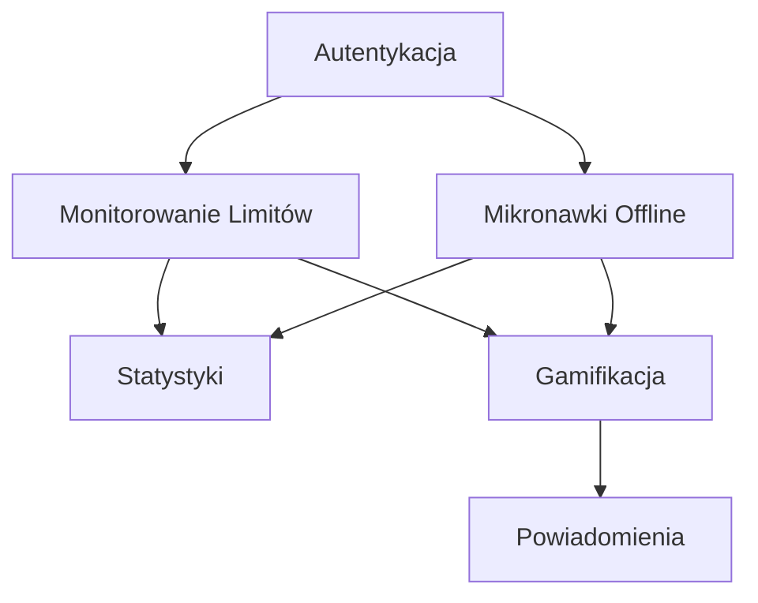

# WF_MVP_Scoping dla SkillReclaim v3

## Cel MVP
Budowa minimalnego produktu, który rozwiązuje **główny problem** – utratę umiejętności psychologicznych z powodu cyfrowego uzależnienia – w 2-3 tygodniach.

## 4 Kluczowe Użytkownicy
1. **Profesjonaliści z branży tech** – szukają skupienia i kreatywności.
2. **Studenci** – mają problem z prokrastynacją.
3. **Freelancerzy** – potrzebują wytrwałości.
4. **Osoby z digital detoxem** – chcą dobrego samopoczucia.

## Minimalne Funkcje
### 1. Autentykacja
- Rejestracja przez email lub Google.
- Logowanie.
- Przegląd profilu.

### 2. Monitorowanie Limitów Online (Ręczne)
- **Wybór Dziedziny:** Skupienie, wytrwałość, kreatywność, dobre samopoczucie.
- **Wprowadzanie Danych:** Formularz do wpisania czasu spędzanego na aplikacji/witrynie.
- **Powiadomienia Emailowe:** Alert o bliskim przekroczeniu limitu.

### 3. Mikronawki Offline
- **Lista Ćwiczeń:** Dla każdej dziedziny 2-5 minutowych ćwiczeń (np. medytacja skupienia).
- **Tracking Postępów:** Prosty tracker z zaznaczaniem ukończonych ćwiczeń.

### 4. Gamifikacja
- **Punkty:** Za każde ćwiczenie i spełnione limit – 10 punktów.
- **Rangi:** Od "Początkujący" do "Mistrz Umiejętności".
- **Nagrody:** Premium za 7 dni ciągłych.

### 5. Statystyki
- **Dzienna Statystyka:** Wykres punktów i ukończonych ćwiczeń.
- **Tygodniowa Statystyka:** Podsumowanie za tydzień.

## Technologie
- **Frontend:** React – Twój stack, łatwy do wdrożenia.
- **Backend:** Firebase – Hosting + baza danych + autentykacja.
- **Emaili:** SendGrid – Darmowy plan dla 100 emaili/dzień.

## Diagram Struktury

## Koszty MVP
- **Firebase:** Darmowy plan dla pierwszych 10GB danych.
- **SendGrid:** Darmowy plan dla 100 emaili/dzień.
- **Hosting:** Firebase Hosting – Darmowy.
- **Całkowity:** 0$.

## Wyzwania Techniczne
- **Firebase Skalowalność:** Może być mało wydajne dla dużych ilości użytkowników, ale dla MVP wystarczy.
- **Powiadomienia Push:** Dla web app są trudne, ale emailowe wystarczają.

## Co Nie Jest W MVP
- **Automatyczne Śledzenie:** Ręczne wprowadzanie danych.
- **AI Sugestie:** Po prostych limity.
- **Chrome Extension:** Brak.
- **Community Forum:** Brak.
- **Integracje:** Brak Notion/Todoist.

## Testy MVP
- **Beta Testy:** 50 osób z newslettera.
- **Feedback:** Formularz z pytaniami o funkcjach i UX/UI.
- **Iteracje:** Poprawki na podstawie opinii.

## Czas Realizacji
- **Autentykacja:** 1 dzień.
- **Monitorowanie Limitów:** 3 dni.
- **Mikronawki Offline:** 2 dni.
- **Gamifikacja:** 2 dni.
- **Statystyki:** 1 dzień.
- **Testy:** 1 tydzień.
- **Całkowity:** 2-3 tygodnie.